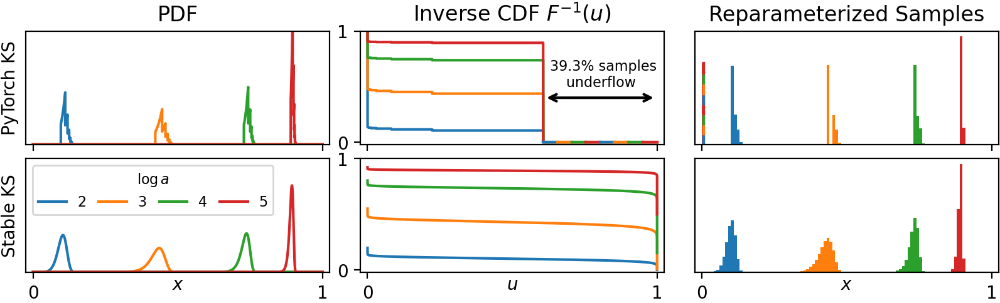

# Stabilizing the Kumaraswamy Distribution

Repository containing code for the paper ["Stabilizing the Kumaraswamy Distribution"](https://openreview.net/forum?id=baZLwdphqw)


## Visualization

<div align="center">
  
  <br>
  <em>Stabilizing log(1 - exp(x)) terms eliminates numerical instabilities in the KS log-pdf and inverse CDF.</em>
</div>


## Authors

- **[Max Wasserman](mailto:maxw14k@gmail.com)** (University of Rochester)
- **[Gonzalo Mateos](mailto:gmateosb@ur.rochester.edu)** (University of Rochester)


## Setup

Execute setup.py with the following command: pip install -e .


## Project Structure

The repository is organized as follows:

```bash
.
├── src            # Stable KS, tanh-N, & models (VAE, Neural Bandits, GNNs)
├── data           # Datasets used in experiments
├── figures        # Raw figure files used in the paper
├── figures_src    # Code to generate the figures
├── experiments    # Scripts for running experiments
└── README.md      # Project documentation
```

## Citation

If you find this work helpful, please cite our paper:

```bibtex
@article{wasserman2025stabilizing,
  title={Stabilizing the Kumaraswamy Distribution},
  author={Wasserman, Max and Mateos, Gonzalo},
  journal={Transactions on Machine Learning Research},
  year={2025}
}
```